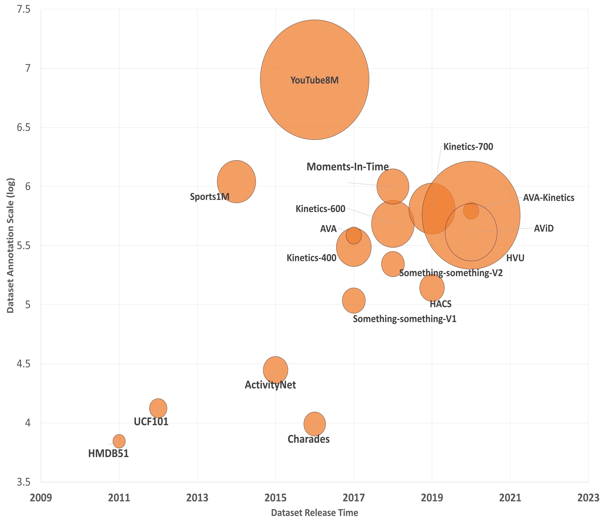
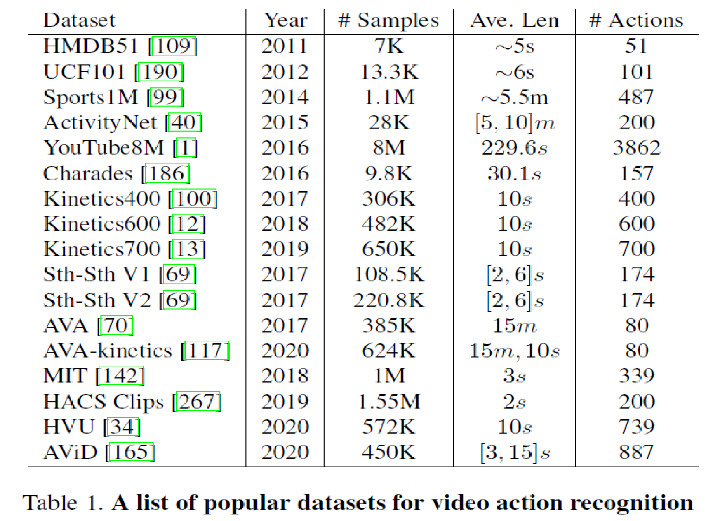

## Action Recognition Dataset
| 数据集 | 动作类型 | 类别个数 | 数据来源 | 数据量 | 发布年份 | Sota精度 |
|:----:|:------:|:------:|:------:|:------:|:------:|:------:|
|[UCF101](https://www.crcv.ucf.edu/data/UCF101.php) | 化妆、刷牙、拳击等 | 101 | Youtube | 13,320 | 2012 | 98.69% |
|[HMDB51](https://serre-lab.clps.brown.edu/resource/hmdb-a-large-human-motion-database/) | 吃东西、洗头、射击 | 51 | Youtube、公开数据集、电影 | 7000 | 2011 | 85.1% |
|[Sport-1M](https://cs.stanford.edu/people/karpathy/deepvideo/) | 体育项目 | 487 | Youtube | 1,133,158  | 2014 | 75.5% |
|[Jester](https://20bn.com/datasets/jester) | 手势 | 27 | 未知 | 148,092 | 2018 | 97.4% |
|[SomethingSomethingV2](https://20bn.com/datasets/something-something) | x sth x sth | 174 | 未知 | 220,847 | 2018 | 69.6% |
|[kenetics](https://deepmind.com/research/open-source/kinetics) | 吃东西、洗头、射击 | 400/600/800 | Youtube | 650,000+ | 2020 | 84.9% |

## Action Detection Dataset
| 数据集 | 动作类型 | 类别个数 | 数据来源 | 数据量 | 发布年份 | Map |
|:----:|:------:|:------:|:------:|:------:|:------:|:------:|
|[ActivityNet](http://activity-net.org/) | 吃东西、洗头、射击 | 200+ | Youube | 20,000+ | 2016 | 37.56 |

## Optical Flow
[光流数据集介绍](https://blog.csdn.net/j879159541/article/details/120357129)
Dataset | 数据来源 | 数据量 | 有标注的组数
--------|------|-----|-------
FlyingChairs | 贴图合成 | 22872 | 22872
Sintel | 3D渲染 | 1041 | 1041
KITTi | 3D激光点云 | 194 | 194
MiddleBury | null | 72 | 8

## Motion Object Detection

Dataset  数据来源  数据量  有标注的组数

## Detection
Dataset | 数据来源 | 数据量 | 人数
--------|------|-----|-------
CoCo | xxx | xxx | xxx
VOC | xxx | xxx | xxx

### CoCo
[COCO-detection数据集格式](https://blog.csdn.net/u011627998/article/details/103070302)
iscrowd:[参考这篇](https://zhuanlan.zhihu.com/p/110676412)主要是由于一些密集的同类，很难用一个框进行标注，因此使用一个密集框标注。通常对于该种框，不参与训练和测试

### WiderFace
[官网链接](http://shuoyang1213.me/WIDERFACE/)
从标注文件readme文件得知，标注box信息是，left, top， w, h, blur, expression, illumination, invalid, occlusion, pose

### Imagenet
[每个label对应的物体类别](https://blog.csdn.net/winycg/article/details/101722445)

