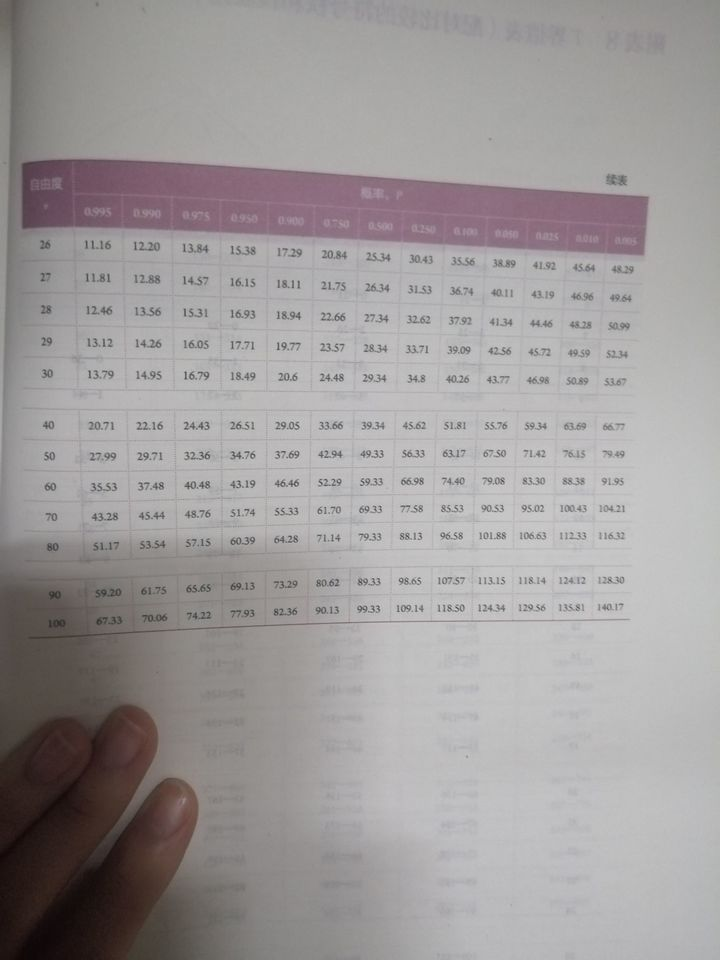

[特征选择(Feature Selection)方法汇总](https://zhuanlan.zhihu.com/p/74198735)
[浅谈常见的特征选择方法](https://www.cnblogs.com/dogecheng/p/12762537.html)
## 皮尔森相关系数
```python
import numpy as np
from scipy.stats import pearsonr
x = np.ran((20))
y = np.ones((20))
r,p = pearsonr(x, y) # r表示相关性,取值范围[-1,1]，P值的意义为认为样本具有总体代表性的犯错概率，大于0.05就太大了，无统计学意义；小于0.05有显著统计学意义，小于0.01有极显著统计学意义
```
### 皮尔森相关系数与相关性强弱关系
相关性 | 负 | 正  
---|---|---
无  | −0.09 to 0.0 | 0.0 to 0.09  
弱 | −0.3 to −0.1 | 0.1 to 0.3  
中 | −0.5 to −0.3 | 0.3 to 0.5  
强 | −1.0 to −0.5 | 0.5 to 1.0  


## 卡方检验
[查找表](https://www.zhihu.com/question/363667974)


[原理](https://zhuanlan.zhihu.com/p/69888032)  
[scores和pvalues排序](https://stats.stackexchange.com/questions/420918/how-are-the-scores-computed-with-selectkbest-sklearn#)  
注意，卡方检验的输入特征必须是非负整数
```python
```