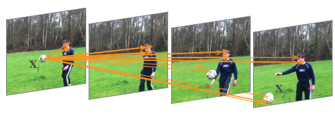
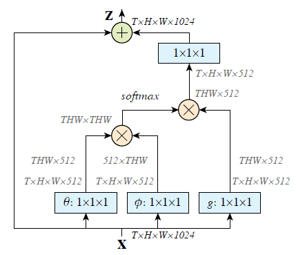

# Non-local Neural Networks
[paper](https://arxiv.org/abs/1711.07971)  
[code](https://github.com/AlexHex7/Non-local_pytorch)

## 文章思想
常见的2D卷积或者3D卷积，特征图上某一点的特征，仅由其邻域附近的特征计算得到，因此可以成为局部特征local-features，但是一些任务比如动作识别，往往需要在时空位置相隔较远的位置计算特征，如下图：  
  
可见对于踢球这个动作，需要结合球的前后变化，对于$x_i$和$x_j$两个相距较远的点2D或者3D卷积获取不到这个两个点的相关特征，因此需要引入非局部特征

## Non-local算子实现
直接放图：  
  
该图中输入是3D卷积的特征，维度为$T \times H \times W \times 1024$, $softmax$之前的分支提取出$THW \times THW$的矩阵，该矩阵可以理解为时空维度上任意两个位置的相关因子，使用$softmax$是归一化，说明该点特征由其他点线性组合得到。其他操作都较容易理解

