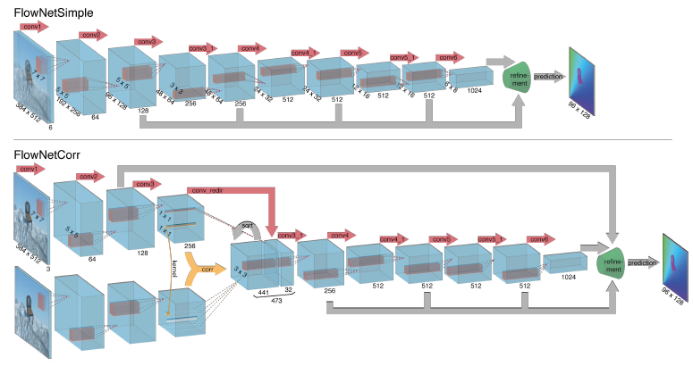
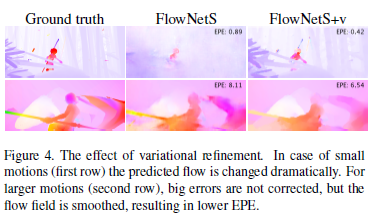

## FlowNet: Learning Optical Flow with Convolutional Networks
[论文地址](https://openaccess.thecvf.com/content_iccv_2015/html/Dosovitskiy_FlowNet_Learning_Optical_ICCV_2015_paper.html)
[pytorch代码](https://github.com/NVIDIA/flownet2-pytorch)
文章在15年发表在CVPR上的文章，目前引用数已经高达2k+，并且原作者的改进版本flownet2.0引用数量也达到了2k+。  
该文章是使用深度学习网络进行光流端到端学习的开山之作，文章不仅提出了两个光流学习的基础backbone，并且针对光流标注数据少的问题，使用3D chairs数据和Flickr上的公开数据，进行数据合成，以生成具有准确标签的大量数据。其实验结果表明，虽然是合成数据，但是学到的网络泛化性还不错。下面将对文章进行简单介绍

### FlownetSimple和FlownetCorr

不用多说，一个是简易结构，另一个使用了correlation volume操作，对不同位置间的特征最match匹配，后面将对该操作做仔细介绍

### correlation volume
类似于卷积操作，但是输入是特征图自己，而不是特征图与卷积核，特征图不同位置的特征的相关性通过计算两个位置局部特征（3x3）的相关性得到。使用滑窗方式实现，对于x1位置，为了减少计算量，仅在x1 [-d,d]邻域内各点做计算，因此每个点可以得到(2d+1)*(2d+1)个输出特征，最后的输出特征为$(2d+1)^2*h*w$，注意这里并没有考虑到stride

### Variational refinement
在decoder过程中，当分辨率上升到原分辨率的1/4时，再继续refine很难提升光流的细节，因此再后面使用[variational approach](https://ieeexplore.ieee.org/abstract/document/5551149/)方法提升细节，效果对比如图


### Loss设计
loss融合了L1损失和EPE损失  
L1不用多说，下面介绍EPE损失，EPE全称EndPoint Error,下面是pytorch计算EPE的代码
```python
# target_flow b,2,h,w
torch.norm(target_flow-input_flow,p=2,dim=1).mean()
```

### 训练调参
训练光流网络通常学习率的设置远低于其他CNN，一般起始学习率设置为1e-4，终止学习率可以设置到1e-8
