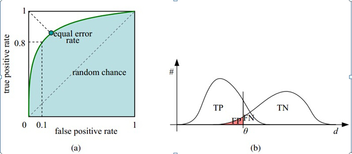

### AUC
AUC(Area under Curve)：Roc曲线下的面积，介于0.1和1之间。Auc作为数值可以直观的评价分类器的好坏，值越大越好

### TPR FPR
TPR = TP / (TP+FN)  表示正样本被检出的概率  
FPR = FP / (FP + TN)表示负样本被误检为阳性的概率  

### ROC曲线
物理意义是：随机取一个正样本和负样本，正样本的logit大于负样本logit的概率


### 计算方式
[博客参考](https://blog.csdn.net/renzhentinghai/article/details/81095857)


### python代码

```python
def auc(logits,labels):
    # logits: numpy array size n,like [0.75,0.1,0.65,0.9,...]
    # labels: numpy array has the same size as logits,like [0,1,1,0,...]
    # First step, sort logits and labels decrementally 
    sortedIndices = logits.argsort()[::-1]
    logits = logits[sortedIndices]
    labels = labels[sortedIndices]
    M = np.sum(labels)
    N = np.sum(1-labels)
    
    # set rank
    ranks = np.zeros_like(labels)
    i = len(logits) - 1
    ranks[i] = 1 
    i = i-1
    while i >= 0:
        if logits[i]==logits[i+1]:
            ranks[i] = ranks[i+1]
        else:
            ranks[i] = len(logits)-i
        i = i - 1
    s = 0
    for i in range(M+N):
        if labels[i] == 1:
            s+=ranks[i]
    return (s-M*(M+1)/2)/(M*N)
```