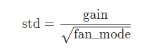
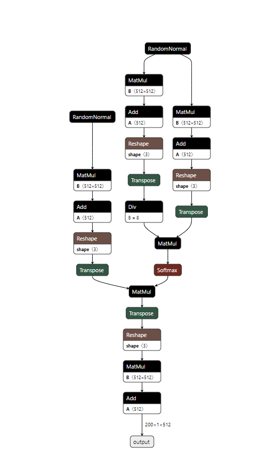

## Kaiming Initialization
[参考](https://paperswithcode.com/method/he-initialization)
凯明初始化，intuition是一个合适的初始化方法，不应该改变信号的幅度，由此计算得到权重分布应该满足0均值高斯分布，并且std为：  
  
上式中,gain与激活函数相关，fanmode,取决于选取输入通道计算或者输出通道计算  
Choosing ``'fan_in'`` preserves the magnitude of the variance of the weights in the forward pass. Choosing ``'fan_out'`` preserves the magnitudes in the backwards pass.
### code
```python
def _calculate_fan_in_and_fan_out(tensor):
    dimensions = tensor.dim()
    if dimensions < 2:
        raise ValueError("Fan in and fan out can not be computed for tensor with fewer than 2 dimensions")

    num_input_fmaps = tensor.size(1)
    num_output_fmaps = tensor.size(0)
    receptive_field_size = 1
    if tensor.dim() > 2:
        receptive_field_size = tensor[0][0].numel()
    fan_in = num_input_fmaps * receptive_field_size
    fan_out = num_output_fmaps * receptive_field_size

    return fan_in, fan_out

def calculate_gain(nonlinearity, param=None):
    r"""Return the recommended gain value for the given nonlinearity function.
    The values are as follows:

    ================= ====================================================
    nonlinearity      gain
    ================= ====================================================
    Linear / Identity :math:`1`
    Conv{1,2,3}D      :math:`1`
    Sigmoid           :math:`1`
    Tanh              :math:`\frac{5}{3}`
    ReLU              :math:`\sqrt{2}`
    Leaky Relu        :math:`\sqrt{\frac{2}{1 + \text{negative\_slope}^2}}`
    SELU              :math:`\frac{3}{4}`
    ================= ====================================================

    Args:
        nonlinearity: the non-linear function (`nn.functional` name)
        param: optional parameter for the non-linear function

    Examples:
        >>> gain = nn.init.calculate_gain('leaky_relu', 0.2)  # leaky_relu with negative_slope=0.2
    """
    linear_fns = ['linear', 'conv1d', 'conv2d', 'conv3d', 'conv_transpose1d', 'conv_transpose2d', 'conv_transpose3d']
    if nonlinearity in linear_fns or nonlinearity == 'sigmoid':
        return 1
    elif nonlinearity == 'tanh':
        return 5.0 / 3
    elif nonlinearity == 'relu':
        return math.sqrt(2.0)
    elif nonlinearity == 'leaky_relu':
        if param is None:
            negative_slope = 0.01
        elif not isinstance(param, bool) and isinstance(param, int) or isinstance(param, float):
            # True/False are instances of int, hence check above
            negative_slope = param
        else:
            raise ValueError("negative_slope {} not a valid number".format(param))
        return math.sqrt(2.0 / (1 + negative_slope ** 2))
    elif nonlinearity == 'selu':
        return 3.0 / 4  # Value found empirically (https://github.com/pytorch/pytorch/pull/50664)
    else:
        raise ValueError("Unsupported nonlinearity {}".format(nonlinearity))
```

## MultiHeadAttention多头注意力机制
注意多头是将特征维度进行分组进行注意力，最后再concat，具体实现使用了reshape,pytorch提供了该模块，torch.nn.MultiheadAttention，并且可以[转换为onnx](https://github.com/pytorch/pytorch/issues/78060)，具体结构如下:  


## transformer encoder
包含了位置编码，多头，层归一化和FFN前馈网络