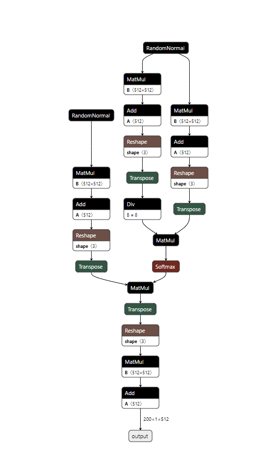
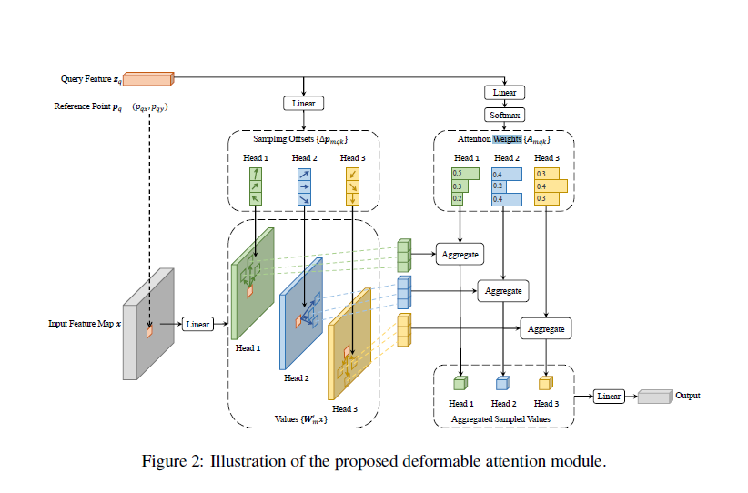

# DETR
[源代码](https://github.com/facebookresearch/detr)

[匈牙利算法python实现](https://blog.csdn.net/weixin_40779727/article/details/116940406)
匈牙利算法最坏情况复杂度为$O(n^3)$

## MultiHeadAttention多头注意力机制
注意多头是将特征维度进行分组进行注意力，最后再concat，具体实现使用了reshape,pytorch提供了该模块，torch.nn.MultiheadAttention，并且可以[转换为onnx](https://github.com/pytorch/pytorch/issues/78060)，具体结构如下:  

## transformer encoder
包含了位置编码，多头，层归一化和FFN前馈网络

## transformer decoder
比encoder更加复杂，输入除了特征memory，增加了output特征，输出位置编码。decoder进行了两次多头注意力机制，第一次是output特征自注意力，第二次是output特征和memory进行注意力机制，同样后面也有层归一化和前馈层
输出维度6*100*2*256，6是decoder的层数，100是query目标数，2是batch size,256是feature通道数，后面再用线性层直接回归类别和目标框，框的范围为0~1

# Deformable DETR
借鉴DCN(deformable convolution)思想，降低key的数量从HW到K，并且K个key的位置可以使用query去学，这样可以降低计算量，加快收敛速度

该种计算方式虽然降低了计算量，但是与deformable convolution一样，比较难部署
