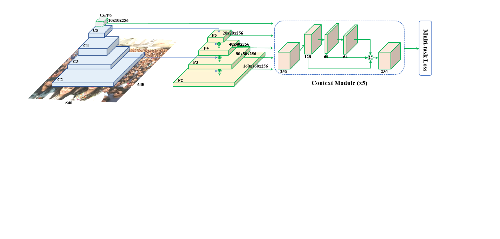

## RetinaFace
[github开源工程](https://github.com/biubug6/Pytorch_Retinaface)
[ncnn样例](https://github.com/Tencent/ncnn/blob/master/examples/retinaface.cpp)
[论文](https://arxiv.org/abs/1905.00641)

### 论文介绍
文章提出一个单阶段的人脸检测算法，框架简洁高效，同时引入多任务，同时进行特征点预测以及mesh网格预测任务提升精度,网络结构如下


### 代码解读
这里主要介绍github源码中使用的mobilenet0.25轻量网络的细节：
1.输入图像大小640x640，输入的box信息为左上点坐标和右下点坐标,目标的box为center坐标和长宽，网络回归的是encode之后的参数，encode主要是将绝对值编码为相对于anchor本身的变换参数，具体如下：
```python
param_1 = (truth_center_x - ancher_center_x)/ancher_width
param_2 = (truth_center_y - ancher_center_y)/ancher_height
param_3 = torch.log(truth_width/ancher_width)
param_4 = torch.log(truth_height/ancher_height)
```
在预测时需要同时进行解码

2.multi-level features，使用了三个不同层级的feature map，从高到底size分别为[20,20]，[40,40],[80,80]，每个feature的不同位置对应的stride为[8, 16, 32]，并且每个feature点设置2个anchor，候选框边长分别设置为[[16, 32], [64, 128], [256, 512]]，由于是预测人脸框，候选框长宽比始终保持1：1，那么共有3x2=6种候选框，算上不同feature所有点，共有2x(20*20+40*40+80*80)=16800个候选框。

3.每个候选框可以依据stride和候选框预设的长宽计算初始的框位置，然后与目标框进行对比，计算出可能的每个候选框对应的IOU最大真实框，如果IOU小于阈值，则类别回归目标设置为0。

4.输出维度，box：4*num_anchors=8 landmark:10*number_anchors class_conf: num_anchors*num_class

5.正样本框匹配
1）先计算gt与候选框的IOU值，再依据IOU值，选出每个候选框对应IOU最大的gt框
2）计算每个gt框对应的IOU值最大的候选框，依据该结果，保证每个gt至少对应一个候选框
3）IOU小于阈值，作为负样本
4）返回n个候选框的目标conf值（0或者1），box目标回归值和landmark目标回归值，无论正样本负样本，都会通过encoder计算出对应的目标回归值，只负样本不会参与回归的loss计算
6）正负样本选取
正样本：conf目标值大于0的样本
负样本：按照与正样本成固定比例选取，比如负样本是正样本的7倍，由于负样本数量很多，需要使用hard negtive mining进行选取
hard negtive mining，依据预设的正负样本比例（7：1），将负样本的logits计算按照损失进行排序，然后取偏差最大的负样本集合，与正样本一起计算loss，具体的代码实现稍显复杂，如下：
```python
# Compute max conf across batch for hard negative mining
# 这里是为了计算logits的偏差大小，该计算方式是简化形式，可以通过1-softmax(x)[gt]来推导
batch_conf = conf_data.view(-1, self.num_classes)
tmp0 = log_sum_exp(batch_conf) 
tmp1 = batch_conf.gather(1, conf_t.view(-1, 1))
loss_c = tmp0 - tmp1

# Hard Negative Mining
# 通过偏差大小进行排序，将每个元素的rank计算出来，在将rank值小于预设值的索引取出
loss_c[pos.view(-1, 1)] = 0 # filter out pos boxes for now
loss_c = loss_c.view(num, -1)
_, loss_idx = loss_c.sort(1, descending=True)
_, idx_rank = loss_idx.sort(1)
num_pos = pos.long().sum(1, keepdim=True)
num_neg = torch.clamp(self.negpos_ratio*num_pos, max=pos.size(1)-1)
tmp2 = num_neg.expand_as(idx_rank)
neg = idx_rank < tmp2
```

6.推理
1）由于实际应用，输入图片的尺寸是不确定的，因此每张输入图像要依据短边最小长度和长边最大长度进行放缩，并保留缩放因子，后面会用来恢复像素坐标的绝对值
2）依据放缩后图像的尺寸，使用priorBox生成基准anchor，依据backbone的每层feature的step和候选框的ratio和size，生成未校正的候选框
3）将图片送入网络，返回置信度，box回归参数、landmark回归参数。并依据预设阈值0.2对box进行过滤,为什么选取一个这么低的阈值？为了后续绘制PR曲线，计算AP
4) 将过滤后的框进行nms操作，去除iou大于阈值0.4的重复框，nms思路是，依据置信度进行排序，然后每次将置信度最高的样本与剩余所有样本计算IOU，去除重复样本后，再对剩余样本进行递归，直到结束，代码如下：
```python
import numpy as np

def py_cpu_nms(dets, thresh):
    """Pure Python NMS baseline."""
    # dets: n x 5， x1,y1,x2,y2, score
    # thresh 阈值
    x1 = dets[:, 0]
    y1 = dets[:, 1]
    x2 = dets[:, 2]
    y2 = dets[:, 3]
    scores = dets[:, 4]

    areas = (x2 - x1 + 1) * (y2 - y1 + 1)
    order = scores.argsort()[::-1]

    keep = []
    while order.size > 0:
        i = order[0]
        keep.append(i)
        xx1 = np.maximum(x1[i], x1[order[1:]])
        yy1 = np.maximum(y1[i], y1[order[1:]])
        xx2 = np.minimum(x2[i], x2[order[1:]])
        yy2 = np.minimum(y2[i], y2[order[1:]])

        w = np.maximum(0.0, xx2 - xx1 + 1)
        h = np.maximum(0.0, yy2 - yy1 + 1)
        inter = w * h
        ovr = inter / (areas[i] + areas[order[1:]] - inter)

        inds = np.where(ovr <= thresh)[0]
        order = order[inds + 1]

    return keep

```

7.指标统计


