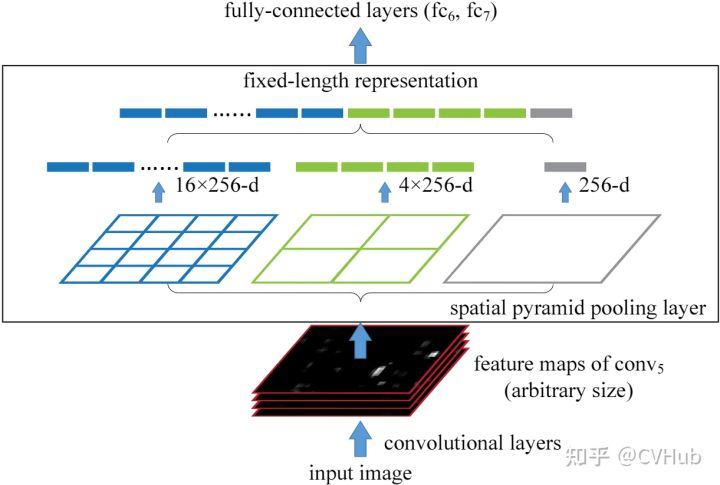
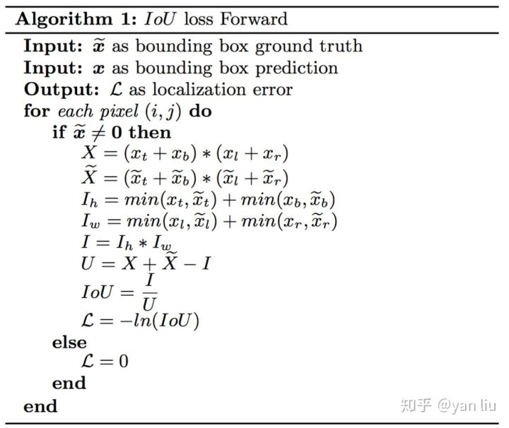
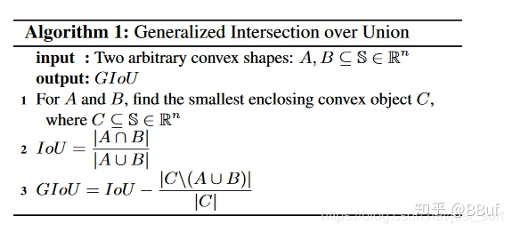
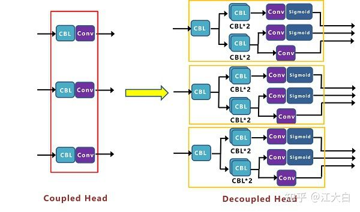
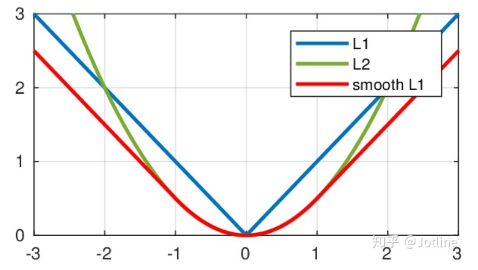

## 单阶段与多阶段的区别
[知乎参考](https://zhuanlan.zhihu.com/p/367069340)
当前人脸检测方法继承了一些通用检测方法的成果，主要分为两类：两阶方法如Faster RCNN和单阶方法如SSD和RetinaNet。两阶方法应用一个“proposal and refinement”机制提取高精度定位。而单阶方法密集采样人脸位置和尺度，导致训练过程中极度不平衡的正样本和负样本。为了处理这种不平衡，采样和re-weighting方法被广泛使用。相比两阶方法，单阶方法更高效并且有更高的召回率，但是有获取更高误报率的风险，影响定位精度。
多阶方法一个重要的模块为ROI pooling层

## Spatial Pyramid Pooling（SPP）

SPPNet只需要计算一次CNN就可以得到整张图的feature map,再通过box坐标映射得到ROI区域的特征图。和RCNN一样，SPP也需要训练CNN提取特征，然后训练SVM分类这些特征。需要巨大的存储空间，并且分开训练也很复杂。而且selective search的方法提取特征是在CPU上进行的，相对于GPU来说还是比较慢的。
在后续YOLO系列中也出现

## ROI pooling 与 fast RCNN
[知乎参考](https://zhuanlan.zhihu.com/p/165324194)
ROI pooling是多阶目标检测任务中常用的层，首先在fast rcnn（首次对box进行回归）中使用,作用是将第一阶段得到的region proposals的box对应到feature map上的区域特征，进行pooling，得到固定维度的输出，才能送入全连接层。ROI pooling计算过程中会涉及两次浮点到整型的“四舍五入”操作，后面网络基于此将两次近似操作合并为一次，降低误差。
Fast RCNN除了proposal网络外，实现了端到端训练。对所有的proposal进行采样，每张图选取128个正负proposal，进行分类器的训练，这样就可以实现对backbone进行梯度回传
### 如果对应到feature map上的ROI区域较小，尺寸小于pooling的输出尺寸，如何处理？
[知乎参考](https://www.zhihu.com/question/353305355)

## Region Proposal Networks(RPN) 和 Faster RCNN
RPN首次在Faster RCNN中提出，用于取代selective search（天下苦秦久矣），使得全部模型能够使用深度学习模型。RPN使用全卷积网络，并且提出了anchor box概念，比如设置k个anchor，RPN会输出2k维度分类结果（objectness score）和4k个坐标回归结果。RPN网络和目标检测网络采取交替训练的方式

## Feature Pyramid Network(FPN)
在faster rcnn的基础上，提出特征金字塔融合模型，使得低层级特征图能够感知到高层级特征，具体结构如下：

## 第一个单阶段检测网络YOLO
[知乎科技猛兽：你一定从未看过如此通俗易懂的YOLO系列](https://zhuanlan.zhihu.com/p/183261974)
速度快，精度低于二阶段,相同anchor中，不同box公用一个分类器，因此会造成冲突。只使用一个feature map做预测
YOLOv1在特征图(7X7)的每一个网格里预测出2个bounding box

## SSD
与YOLO V1不同的是，利用在多个层级的feature map都做预测

## YOLOVX
## RetinaNet与Focal loss
Focal Loss使得模型的训练更专注于困难样本.
[参考博客](https://www.cnblogs.com/king-lps/p/9497836.html)
[二分类与多分类focal loss](https://www.cnblogs.com/CheeseZH/p/13519206.html)

## Anchor-based目标检测算法局限性
1. Anchor的大小，数量，长宽比对于检测性能的影响很大(通过改变这些超参数Retinanet在COCO benchmark上面提升了4%的AP)，因此Anchor based的检测性能对于anchor的大小、数量和长宽比都非常敏感。
2. 这些固定的Anchor极大地损害了检测器的普适性，导致对于不同任务，其Anchor都必须重新设置大小和长宽比。
3. 为了去匹配真实框，需要生成大量的Anchor，但是大部分的Anchor在训练时标记为负样本，所以就造成了样本极度不均衡问题(没有充分利用fore-ground)。
4. 在训练中，网络需要计算所有Anchor与真实框的IOU，这样就会消耗大量内存和时间。

## Anchor-Free 
yolov3,yolox直接回归左上点和右下点距离feature pixel的距离

## IOU loss
[参考知乎](https://zhuanlan.zhihu.com/p/44323675)
IOU loss的计算方式：

## GIOU loss
[参考知乎：目标检测算法之CVPR2019 GIoU Loss](https://zhuanlan.zhihu.com/p/97340657)
IOU loss的缺点：
1）预测框bbox和ground truth bbox如果没有重叠，IOU就始终为0并且无法优化。也就是说损失函数失去了可导的性质。
2）IOU无法分辨不同方式的对齐，例如方向不一致等，如下图所示，可以看到三种方式拥有相同的IOU值，但空间却完全不同。

GIOU计算方式：

## IOU GIOU DIOU CIOU
[参考博客](https://blog.csdn.net/bu_fo/article/details/110428980)

## Decoupled Head
经典的检测算法，分类和box坐标回归使用相同的特征图，但是后续方法证实，不同使用不同分支提取不同的特征会提升精度，该操作称作Decoupled Head

## OTA， Optimal Transport Algorithm
将Label Assign当作二分图匹配来做，可以依据网络的训练，动态的选取样本。

## SimOTA
[知乎详解](https://zhuanlan.zhihu.com/p/394392992)
用于anchor-free检测方法中的正样本选取
优点：
1、simOTA能够做到自动的分析每个gt要拥有多少个正样本。
2、能自动决定每个gt要从哪个特征图来检测。
3、相比较OTA，simOTA运算速度更快。
4、相比较OTA，避免额外超参数。

## 目标检测网络中的 bottom-up 和 top-down理解
[参考博客](https://blog.csdn.net/qq_44442727/article/details/114692401)

## CSP_DarkNet网络解析
### Focus层
[参考](https://zhuanlan.zhihu.com/p/513312921)
位于网络的第一层，将输入图像等间隔抽样成四个子图像，再concat为3*4 channel的图像送到卷积层，可以提升训练速度，但使用到slice操作，硬件未必友好，量化也未必友好

### SPP_Block
全称[Spatial Pyramid Pooling](https://zhuanlan.zhihu.com/p/396724233)，使用不同kernel size的maxpooling层，提取不同感受野的特征，得到更加丰富的特征。插入到网络的layer中，可以提点

### CSP_Layer
全称[Cross Stage Partial Layer](https://blog.csdn.net/cdknight_happy/article/details/107962173?spm=1001.2014.3001.5502)
里面的梯度复用问题有点难理解，听起来就是越往前的节点，会利用到后面多个节点的梯度信息，“这将导致无差异的稠密层反复学习同样的梯度信息”（这句话很难理解），
[mmdetection](https://github.com/open-mmlab/mmdetection/blob/56e42e72cdf516bebb676e586f408b98f854d84c/mmdet/models/utils/csp_layer.py#L75)中，该层的具体实现不太一样，但是会将输入通道压缩为1/2，走两路分支，concate后再卷积一次,这样主干分支计算量就相对减少了  

### L1 L2 Smooth_l1 loss区别
[参考博客](https://blog.csdn.net/weixin_42310154/article/details/119938856)

问题：L1 loss在0点不可导，pytorch如何处理：[当处于0点，pytorch将0当作正值处理](https://github.com/pytorch/pytorch/blob/e8acc2ebb17ec2ce80808f57bfcd68d7d6cbcb1f/aten/src/THCUNN/Abs.cu#L20)

