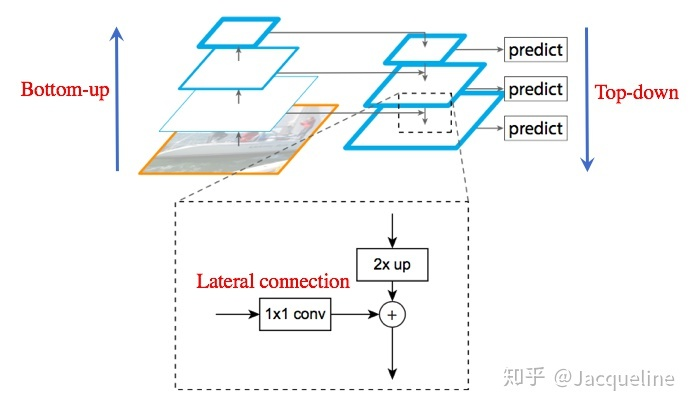
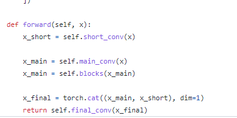

## RCNN
通过selective search方法得到region proposals，然后再把每个proposal resize到固定尺寸输入到CNN网络，得到类别和box回归结果。该方法的缺点是很慢，因为每个proposal都需要重新计算CNN feature。后续SPPNet和Fast RCNN会进行改进

## SPPNets
对于同一张图，RCNN要重复计算多次cnn feature，导致速度很慢。SPPNets提出Spatial Pyramid Pooling层，将每个proposal对应区域的特征，提取为固定长度的vector，送到分类器和回归器中。该方法的缺点是，训练分类器和回归器时，没有对backbone进行训练，因为proposal很多，工程实现困难。fast rcnn对该缺点进行了改进。
首先在SPPNet中提出，将RCNN中的resize输入图像到固定尺寸修改为使用SPP模块将特征resize到固定维度，并且pooling的kernel取了多个不同维度，意味着不同空间分辨率的特征。该模块计算量较大。

## fast RCNN
[知乎参考](https://zhuanlan.zhihu.com/p/165324194)
ROI pooling是多阶目标检测任务中常用的层，首先在fast rcnn（首次对box进行回归）中使用,作用是将第一阶段得到的region proposals的box对应到feature map上的区域特征，进行pooling，得到固定维度的输出，才能送入全连接层。ROI pooling计算过程中会涉及两次浮点到整型的“四舍五入”操作，后面网络基于此将两次近似操作合并为一次，降低误差。
Fast RCNN除了proposal网络外，实现了端到端训练。对所有的proposal进行采样，每张图选取128个正负proposal，进行分类器的训练，这样就可以实现对backbone进行梯度回传
### 如果对应到feature map上的ROI区域较小，尺寸小于pooling的输出尺寸，如何处理？
[知乎参考](https://www.zhihu.com/question/353305355)

## faster RCNN
RPN首次在Faster RCNN中提出，用于取代selective search（天下苦秦久矣），使得全部模型能够使用深度学习模型。RPN使用全卷积网络，并且提出了anchor box概念，比如设置k个anchor，RPN会输出2k维度分类结果（objectness score）和4k个坐标回归结果。RPN网络和目标检测网络采取交替训练的方式

## SSD和YOLO
这两个网络座位一阶段代表性网络，几乎同一时间段提出。区别在于：YOLO在卷积层后接全连接层，即检测时只利用了最高层Feature maps（包括Faster RCNN也是如此）而SSD采用金字塔结构，即利用了conv4-3/fc7/conv6-2/conv7-2/conv8_2/conv9_2这些大小不同的feature maps，在多个feature maps上同时进行softmax分类和位置回归。
SSD精度更高，YOLO速度更快

## FPN
在faster rcnn的基础上，提出特征金字塔融合模型，使得低层级特征图能够感知到高层级特征，具体结构如下：

## RetinaNet
最大的贡献是提出了focal loss，增大预测结果不好的样本权重，降低预测结果很好的样本权重，达到平衡正负样本不均衡的问题

## YOLOV3
[参考博客](https://blog.csdn.net/weixin_51296032/article/details/123009246)
特征图进行了融合，融合后使用三个level的特征图。
YOLOV3在3个特征图的每一个网格中预测出3个bounding box，每个bounding box预测5个值以及分类概率值
YOLOv3使用Logistic regression来预测每个bounding box的confidence,以bounding box与gt的IOU为判定标准,对每个gt只分配一个最好的bounding box.通过利用这种方式,在做Detect之前可以减少不必要的Anchor进而减少计算量。对于与GT框大于0.5的候选框，计算loss时进行忽略
Backbone使用darknet53，与resnet152精度相当但是速度快了2倍，Darknet相比resnet GPU的利用率更高，因此更快。

## YOLOV4
[参考博客:yolov4的全面详解](https://blog.csdn.net/hgnuxc_1993/article/details/120724812)
数据增强：图像几何变换（随机缩放，裁剪，旋转），Cutmix，Mosaic等
损失函数的设计：边界框回归的损失函数的改进 CIOU
增大模型感受野：SPP、ASPP等
引入注意力机制：SE、SAM
特征集成：PAN，BiFPN
激活函数改进：Swish、Mish
后处理方法改进：soft NMS、DIoU NMS

## YOLOV5
数据增强:Mosaic
自适应锚框计算
自适应图片缩放,不固定输入size，自适应将输入分辨率pad到符合要求的最小size，提升推理速度
GIOU_Loss
DIOU_nms：对于一些遮挡目标有改进

## YOLOX
### Anchor Free
### label assign: simOTA
1、simOTA能够做到自动的分析每个gt要拥有多少个正样本。
2、能自动决定每个gt要从哪个特征图来检测。
3、相比较OTA，simOTA运算速度更快。
4、相比较OTA，避免额外超参数。。
### backbone: csp_DarkNet
#### Focus层
[参考](https://zhuanlan.zhihu.com/p/513312921)
位于网络的第一层，将输入图像等间隔抽样成四个子图像，再concat为3*4 channel的图像送到卷积层，可以提升训练速度，但使用到slice操作，硬件未必友好，量化也未必友好

#### SPP_Block
全称[Spatial Pyramid Pooling](https://zhuanlan.zhihu.com/p/396724233)，使用不同kernel size的maxpooling层，提取不同感受野的特征，得到更加丰富的特征。插入到网络的layer中，可以提点

#### CSP_Layer
全称[Cross Stage Partial Layer](https://blog.csdn.net/cdknight_happy/article/details/107962173?spm=1001.2014.3001.5502)
里面的梯度复用问题有点难理解，听起来就是越往前的节点，会利用到后面多个节点的梯度信息，“这将导致无差异的稠密层反复学习同样的梯度信息”（这句话很难理解），
[mmdetection](https://github.com/open-mmlab/mmdetection/blob/56e42e72cdf516bebb676e586f408b98f854d84c/mmdet/models/utils/csp_layer.py#L75)中，该层的具体实现不太一样，但是会将输入通道压缩为1/2，走两路分支，concate后再卷积一次,这样主干分支计算量就相对减少了  

### Decoupled Head
### GIOU Loss

## YOLOV6
[YOLOV6](https://zhuanlan.zhihu.com/p/533127196)
美团的工作，网友评价一般，槽点有点多，主要有以下几点改进:
1)重参数化思想，对backbone中的卷积层和block用rep方式替换
2)针对decoupled-head进行性能优化
3)anchor-free、simOTA

## YOLOV7
[YOLOV7](https://zhuanlan.zhihu.com/p/554769215)
相同精度下FPS最高
1)网络结构ELAN，分组卷积+shuffle
2)基于concatenation的模型的缩放策略
3)重参化："我们发现RepConv里面的恒等映射损害了ResNet的残差连接和DenseNet的cat操作，而这两个操作能够给不同特征层带来梯度的多样性。因此，我们设计了一个去除恒等映射的RepConv-N，如果遇到残差连接或者cat操作时，使用RepConv-N，而不是RepConv"
4)从粗到细的标签分配

