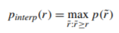

### mAP
[参考网址](https://zhuanlan.zhihu.com/p/88896868)
[参考网址](https://towardsdatascience.com/breaking-down-mean-average-precision-map-ae462f623a52#1a59)  
TP: IOU > threshold 并且预测为该类  
FP：IOU < threshold 并且预测为该类；重复的框被认为FP  
FN：没有框被预测为该类；IOU> threshold 并且预测为其他类  
Interpolated precision： 为了防止pr曲线出现摇摆显现定义的，实际pr曲线为 interp-precision - recall曲线：  
  
AP: Average Precision，指定类别的precision-recall曲线的线下面积，注意只与TP和FP有关，与FN没有关系
mAP：多个类别平均的AP  
mAP@0.5：IOU取0.5时的mAP  
mAP@.5:.95：IoU从0.5到0.95以0.05为步长的mAP的均值  

