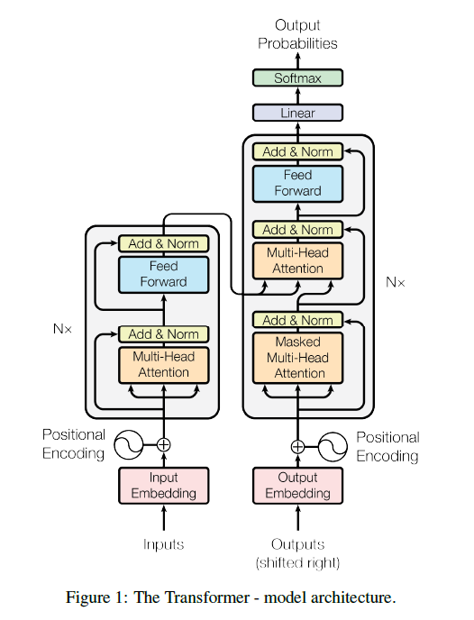
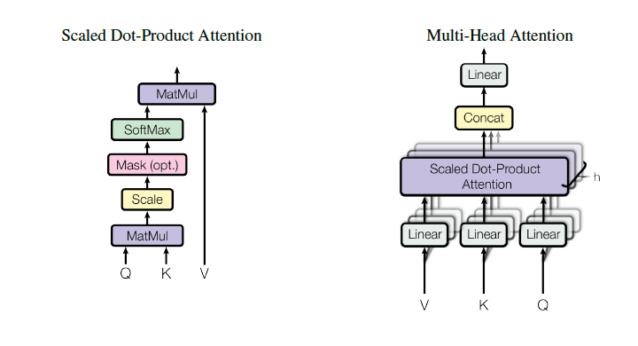

# bert网络结构

## 多头注意力部分

输入$N_{patch}$个patch，每个patch特征维度为$D_in$

### Step1,将输入特征转换到Q,K,V
需要参数矩阵$W_Q$,$W_K$,$W_V$,对应计算量为$D_{in}\times D_{QKV}\times 3$,这里由于是自注意力机制，Q,K,V三者特征维度相等，由于是多头机制，多头个数为$N_{head}$,总的计算量为：  
$N_{patch} \times N_{head} \times D_{in}\times D_{QKV}\times 3$

### Step2,注意力机制
$N_{patch} \times N_{head} \times N_{patch} \times D_{QKV}$  
注意这里省略了求和的计算

### Step3,Feed-Forward Network（FNN）
  
前馈网络在每个patch单独计算，使用共享参数，由两层全连接层组成，参数量分别为$D_{in} \times D_{hidden}$和$D_{hidden} \times D_{in}$，计算量为:  
$N_{patch} \times 2 \times D_{in} \times D_{hidden}$