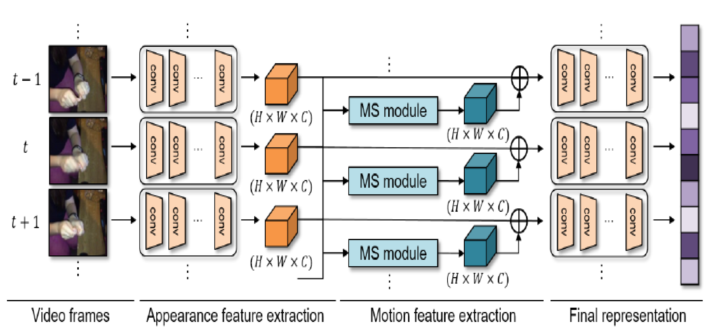
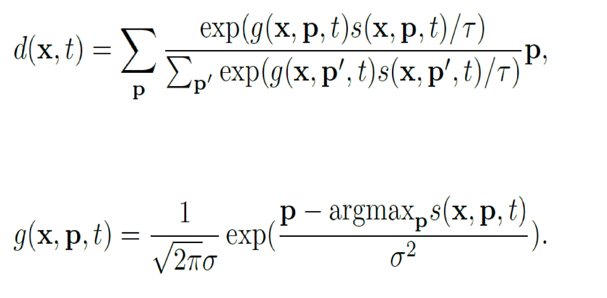
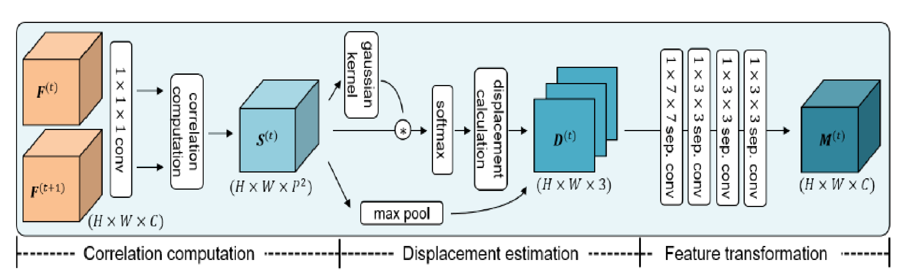

## 论文简介
[论文地址]()
[论文源码](https://github.com/arunos728/MotionSqueeze)
光流是行为识别领域常用的一种输入模态，通常可以提升模型的精度。但是光流的计算量很大，因此文章提出一种MotionSqueeze模块，模拟光流网络计算cost volume的过程，显示地计算feature的光流。该模块可以插入任意网络两层的中间，仅使用少量计算量，就在somethingV2数据集是达到sota，超过双流的TSM。

## 模块详细介绍
输入，H x W x C的feature map，得到 H x W x C的动态feature map，再使用残差连接的方式输出H x W x C,具体计算方式：
1.使用correlation层计算feature map每个位置与其PxP邻域位置的相关性，输出(PxP) x H x W大小的feature map，计算量为(PxP) x H x W x C 
2.依据correlation层输出，计算光流，这里使用kernel-soft-argmax操作，一个原因是该操作可导，另一个原因是可以抑制outliers点对结果的影响，具体公式为：

3.confidence map计算，confidence map是指每一个位置计算出的P x P个相关值中的最大值
4.refinement,对2和3计算出的结果进行concat得到H x W x 3的feature，再进行一系列卷积操作，refine到H x W x C 的特征，在于原始输入进行残差连接
