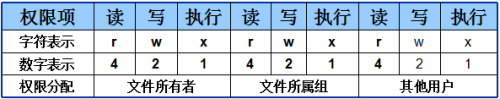

### 
```bash
sudo su
#新建用户,一定要加-m 否则不会创建home目录
useradd -m csdn
#设置密码
passwd csdn
#指定mi命令解释程序
usermod -s /bin/bash csdn
#指定home目录
usermod -d /home/csdn csdn
#查看用户属性
cat /etc/passwd
#修改目录拥有者
chown csdn /home/DATA/test/xxx

#新建组
groupadd -g 1022 groupname

#添加用户到组
gpasswd -a username groupname

#更改文件夹所属用户组
chgrp -R groupname Detection/

#更改文件夹权限只有拥有着和组内成员有读写权限
chmod 770 -R Detection/

```


## samba权限
[参考博客](https://www.cnblogs.com/zjutzz/p/13340409.html#%E9%85%8D%E7%BD%AEsamba%E6%9C%8D%E5%8A%A1%E5%99%A8)

```bash
sudo smbpasswd wjj
sudo service smbd restart
```

## windows samba删除账户历史信息
[凭据管理器](https://blog.csdn.net/alimingh/article/details/111637370)