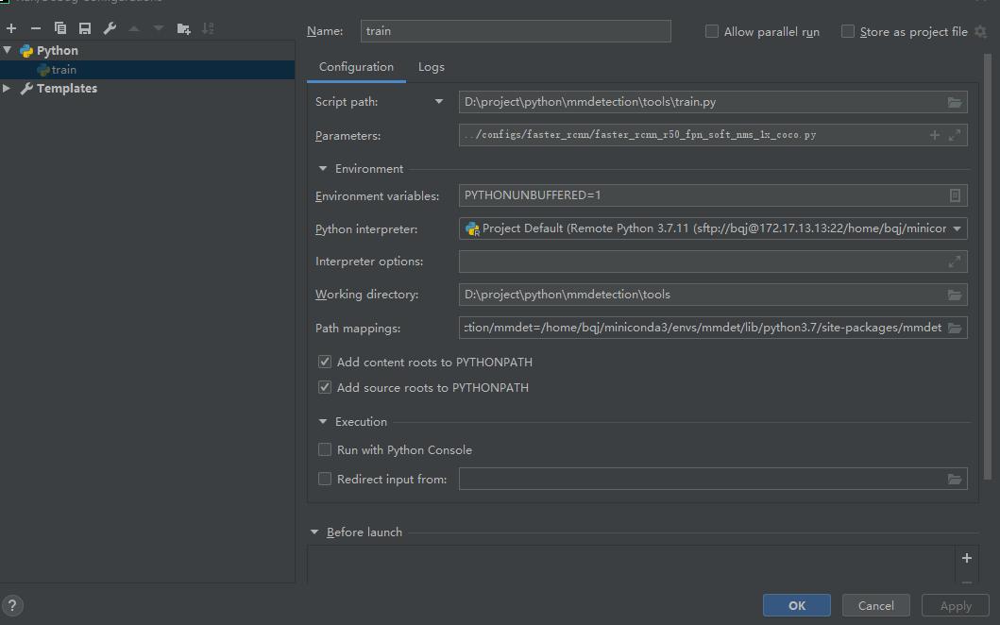

## vscode+remote ssh
插件： remote ssh
gui显示图片：x11转发
1.服务器端：安装xarclock xorg
```shell
sudo apt-get install xarclock xorg
export DISPLAY=172.17.122.112:0.0  #172.17.193.32是pc ip
xarclock #会弹出小的图像，记得关闭
```
2.修改配置文件/etc/ssh/sshd_config，增加下列配置项
```
X11Forwarding yes
X11DisplayOffset 10
X11UseLocalhost no
AddressFamily inet
AllowTcpForwarding yes
```
3.重启ssh服务
```shell
service ssh restart
```
4.执行下xauth list | tail -n 1 确认下结果是否正确
```shell
root@arc-admin-bl1vqf-766f9c85c8-hkmrl:~# xauth list | tail -n 1
arc-admin-bl1vqf-766f9c85c8-hkmrl:14 MIT-MAGIC-COOKIE-1 e24e766076f605842051f76bd793dbfc
```
## opencv imshow报错
terminate called after throwing an instance of 'cv::Exception' what(): OpenCV(4.3.0) /media/data1/bqj/software/app/src/opencv/modules/highgui/src/window.cpp:651: error: (-2:Unspecified error) The function is not implemented. Rebuild the library with Windows, GTK+ 2.x or Cocoa support. If you are on Ubuntu or Debian, install libgtk2.0-dev and pkg-config, then re-run cmake or configure script in function 'cvShowImage'
[重新编译opencv](https://blog.csdn.net/chengyq116/article/details/104308926)
sudo apt-get install -y libgtk2.0-dev pkg-config
-D WITH_GTK=ON

### xarclock出先Error: Can't open display: 172.17.122.125:0.0
以上配置全部正确的情况下，还是无法运行成功，很可能是windows的入站规则出了问题。需要设置网络规则：
1.打开控制面板->windows防火墙->高级设置
2.选择入站规则->新建规则
3.规则类型选择端口，下一步，所有本地端口
4.下一步，允许连接
5.下一步，全选
6.下一步，名称输入端口配置，完成即可
注意：可能配置以后还是不生效，可能是因为入站规则没有按照顺序走，前面的某些规则导致不通，所以再点一下"还原默认值"按钮，然后再重新配置

### 于remote ssh联合使用
1.远程连接工程目录后，在vscode terminal中运行
```shell
export DISPLAY=172.17.122.112:0.0  #172.17.122.112是pc ip
xarclock #会弹出小的图像，记得关闭
```
2.在需要运行的代码加入代码
```python
import os
os.environ['DISPLAY'] = '172.17.122.112:0.0'
```
3.运行代码

### remote ssh免密登陆
[参考博客](https://blog.csdn.net/weixin_42762234/article/details/122368402)
```shell
#将本机的id_rsa.pub里的内容拷贝到远端authorized_keys
vim  ~/.ssh/authorized_keys
#修改文件权限
chmod 700 ~/.ssh/
chmod 600 ~/.ssh/authorized_keys

#本地机配置
Host remote_server
    HostName 172.17.xx.xx
    User root
    Port xxx
    IdentityFile "C:\Users\xxx\.ssh\id_rsa"
    ServerAliveInterval 20
    ServerAliveCountMax 999
```


## ptvsd+vscode
### 远程和桌面ptvsd安装
```python
pip install ptvsd
```

### 运行程序插入代码
```python
import ptvsd
ptvsd.enable_attach(address = ('172.17.13.13', 5678)) #Ip 为远程IP
ptvsd.wait_for_attach()
```

### vscode配置
```json
{
  "version": "0.2.0",
  "configurations": [
    {
      "python": "/opt/miniconda3/envs/mmlab/bin/python",
      "name": "Python: lauch-file",
      "type": "python",
      "request": "launch",
      "program": "${file}",
      "console": "integratedTerminal",
      "justMyCode": false,
      "cwd": "${workspaceRoot}",
      "env": {
        "CUDA_VISIBLE_DEVICES": "7"
      },
      "args": [
        "--target","20220803"
      ]
    },
    {
      "python": "/opt/miniconda3/envs/mmlab/bin/python",
      "name": "Python: train-debug",
      "type": "python",
      "request": "launch",
      "program": "${file}",
      "console": "integratedTerminal",
      "justMyCode": false,
      "cwd": "${workspaceRoot}",
      "env": {
        "CUDA_VISIBLE_DEVICES": "7"
      },
      "args": [
        "./scripts/xxx/configs/xxx.py",
        "--gpu-ids",
        "0",
        "--work-dir",
        "../../../labs/debug"
      ]
    },
    {
      "python": "/opt/miniconda3/envs/mmlab/bin/python",
      "name": "Python: dist-debug",
      "type": "python",
      "request": "launch",
      "program": "/opt/miniconda3/envs/mmlab/lib/python3.7/site-packages/torch/distributed/launch.py",
      "console": "integratedTerminal",
      "justMyCode": false,
      "cwd": "${workspaceRoot}",
      "env": {
        "CUDA_VISIBLE_DEVICES": "6"
      },
      "args": [
        "--nproc_per_node=1",
        "--master_port=-26789",
        "./scripts/xxx/train.py",
        "./scripts/xxx/configs/xxx.py",
        "--launcher",
        "pytorch",
        "--gpu-ids",
        "0",
        // "--work-dir",
        // "../../../labs/debug",
        "--seed",
        "228",
      ]
    }
  ]
}
```

### 运行
1. 先运行远程程序
2. 在本地切换到attach任务
3. F5即可停在断点出
   
## Pycharm
pycharm专业版本提供了远程调试的功能，[教程链接](https://www.cnblogs.com/xuegqcto/p/8621689.html)  
注意远程目录的映射  
设置debug运行脚本和参数传递：菜单Run->Configuration


## PDB调试
利用python的pdb模块进行调试
[参考博客](https://www.cnblogs.com/xiaohai2003ly/p/8529472.html)
```
python -m pdb xxx.py
```

