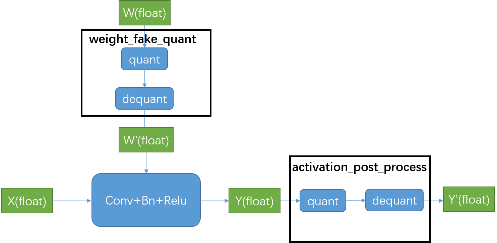

# Pytorch quantilization量化源码解析
pytorch提供了qat量化感知训练方式，相对于训练后量化，该种方式能够将量化融入训练过程，使得正向和反向传播使用的是量化再反量化后的值，因此可以提升量化的精度

## pipeline
pytorch进行量化感知训练，主要分为下面几步：
### fuse_model
需要将可以量化的单元进行fuse，比如将conv+bn+relu合并为一个module，这样合并后的module方便添加两个observer进行weight和activation量化信息的统计，合并后的类的定义位于文件torch.ao.quantization.fuser_method_mappings.py和torch.nn.intrinsic.modules.fused.py
```python
DEFAULT_OP_LIST_TO_FUSER_METHOD : Dict[Tuple, Union[nn.Sequential, Callable]] = {
    (nn.Conv1d, nn.BatchNorm1d): fuse_conv_bn,
    (nn.Conv1d, nn.BatchNorm1d, nn.ReLU): fuse_conv_bn_relu,
    (nn.Conv2d, nn.BatchNorm2d): fuse_conv_bn,
    (nn.Conv2d, nn.BatchNorm2d, nn.ReLU): fuse_conv_bn_relu,
    (nn.Conv3d, nn.BatchNorm3d): fuse_conv_bn,
    (nn.Conv3d, nn.BatchNorm3d, nn.ReLU): fuse_conv_bn_relu,
    (nn.Conv1d, nn.ReLU): nni.ConvReLU1d,
    (nn.Conv2d, nn.ReLU): nni.ConvReLU2d,
    (nn.Conv3d, nn.ReLU): nni.ConvReLU3d,
    (nn.Linear, nn.BatchNorm1d): fuse_linear_bn,
    (nn.Linear, nn.ReLU): nni.LinearReLU,
    (nn.BatchNorm2d, nn.ReLU): nni.BNReLU2d,
    (nn.BatchNorm3d, nn.ReLU): nni.BNReLU3d,
}
```
conv+bn+relu会被转化为对应的nni.ConvBnReLU2d，并在原先的bn和relu的位置，增加Identity模块，用作占位
### torch.quantization.prepare_qat对fused model进一步进行量化训练准备
查看该函数的定义，其分别调用了propagate_qconfig_，convert，prepare三个函数，依据这三个函数的功能，来解读量化训练模型准备阶段做了哪些事情：
1.propagate_qconfig_
该函数会给模型的每一个模块，增加一个qconfig属性，该属性定义了weight和activation的量化策略，比如选择量化值的范围(0,255)或者(-128,127)，统计方法(minmax,movingAverageMinMax)，以及数据类型(uint8，int8)等。注意qconfig属性实际上是一个类的实例化方法，使用该方法，可以实例化不同的伪量化节点。因此不同模块的qconfig的属性实际上是相同的，除非手动进行修改。在后续步骤中会为每个模块调用qconfig进行伪量化节点实例化
```python
##
model.qconfig = torch.quantization.get_default_qat_qconfig("qnnpack")
propagate_qconfig_(model, qconfig_dict=None)
```

2.convert
该函数将fused model中的模块进一步替换为量化训练需要的模块，映射关系如下：
```
# Default map for swapping float module to qat modules
DEFAULT_QAT_MODULE_MAPPINGS : Dict[Callable, Any] = {
    nn.Conv2d: nnqat.Conv2d,
    nn.Conv3d: nnqat.Conv3d,
    nn.Linear: nnqat.Linear,
    nn.modules.linear.NonDynamicallyQuantizableLinear: nnqat.Linear,
    # Intrinsic modules:
    nni.ConvBn1d: nniqat.ConvBn1d,
    nni.ConvBn2d: nniqat.ConvBn2d,
    nni.ConvBn3d: nniqat.ConvBn3d,
    nni.ConvBnReLU1d: nniqat.ConvBnReLU1d,
    nni.ConvBnReLU2d: nniqat.ConvBnReLU2d,
    nni.ConvBnReLU3d: nniqat.ConvBnReLU3d,
    nni.ConvReLU2d: nniqat.ConvReLU2d,
    nni.ConvReLU3d: nniqat.ConvReLU3d,
    nni.LinearReLU: nniqat.LinearReLU,
}
```
以nniqat.ConvBnReLU3d为例，该类继承自_ConvBnNd，位于文件torch\nn\intrinsic\qat\modules\conv_fused.py，该类的初始化文件调用了该代码：
```python
self.weight_fake_quant = self.qconfig.weight()
```
这行代码的作用是为模块的权重参数添加伪量化节点，到此模块只对权重添加了伪量化节点，对于模块输出的值还没有伪量化节点，这部分工作将在下一步中进行
3.prepare
```python
prepare(model, observer_non_leaf_module_list=set(mapping.values()), inplace=True)
```
该步骤将继续调用add_observer_函数，为模块增加observer,调用后，模块多增加“activation_post_process”属性，该属性为输出值的伪量化节点，并且会将该observer的forward函数，通过register_forward_hook添加到forward hooks列表中，让模块在forward后，自动调用observer的forward函数，进行伪量化操作，并将模块输出经过量化和反量化送入下一层
```python
    def insert_activation_post_process(m, special_act_post_process=None):
        """ Adds an activation post process module and register
        a post hook that calls the module
        """
        # We don't insert observer/fake_quantize for DeQuantStub
        if needs_observation(m) and not isinstance(m, DeQuantStub):
            # observer and hook will be gone after we swap the module
            m.add_module('activation_post_process', get_activation_post_process(
                m.qconfig, device, special_act_post_process))
            # Register observer as the first entry in the hook list
            # All post forward hooks are preserved and will be executed after the observer before convert
            handle = register_activation_post_process_hook(m)
            m._forward_hooks.move_to_end(handle.id, last=False)
```

完成这三部，量化训练需要的模型就准备好了

最终效果可以用下图展示：



## Introducing Quantized Tensor
[官方文档](https://github.com/pytorch/pytorch/wiki/Introducing-Quantized-Tensor)

## how to write quantized ops/kernels.
[官方文档](https://github.com/pytorch/pytorch/blob/master/aten/src/ATen/native/quantized/README.md)

## Model Quantization for PyTorch (Proposal) 
[链接](https://github.com/pytorch/pytorch/issues/18318)

## torch_quantization_design_proposal
[链接](https://github.com/pytorch/pytorch/wiki/torch_quantization_design_proposal)